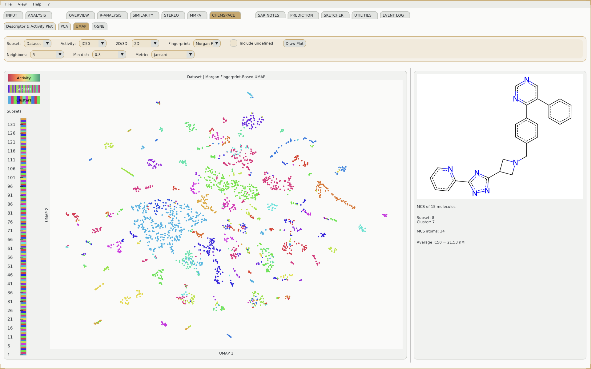

# SARgate

[](https://www.rdkit.org/)
[](https://www.python.org/)
[](LICENSE)
[](https://github.com/I2DLab/SARgate/releases)
[](https://doi.org/10.5281/zenodo.20282517)



SARgate is a molecular toolkit for chemical space and structure-activity relationship analysis.

It can be used either as a pre-built executable or directly from source code.

---

## Table of Contents

- [Features](#features)
- [Quick Start](#quick-start)
- [Download SARgate](#download-sargate)
- [Run from Source](#run-from-source)
- [Build from Source](#build-from-source)
- [Repository Structure](#repository-structure)
- [Troubleshooting](#troubleshooting)
- [Third-party Software](#third-party-software)
- [Contributing](#contributing)
- [Citation](#citation)
- [License](#license)

---

## Features

SARgate provides a local desktop workflow for molecular analysis tasks related to chemical space and structure-activity relationships.

The project includes:

- source-based execution through `launcher.py`;
- a main application entry point in `app/main.py`;
- a structured application layout with dedicated `app/`, `assets/`, `data/`, and `installer/` folders;
- dependency management through `installer/requirements.txt`;
- executable packaging support through PyInstaller;
- platform-specific release archives for Windows, macOS Apple Silicon, and Linux.

---

## Quick Start

The fastest way to use SARgate is to download a pre-built executable from the GitHub Releases page:

<https://github.com/I2DLab/SARgate/releases>

After downloading the archive for your operating system, extract it and follow the executable-specific instructions provided in:

[README_EXECUTABLES.md](README_EXECUTABLES.md)

For source-based execution, Conda or Miniconda is recommended because SARgate depends on RDKit.

---

## Download SARgate

If you only want to use SARgate, download the pre-built executable for your operating system from the Releases page:

<https://github.com/I2DLab/SARgate/releases>

Available builds:

| Operating System | Build Archive |
| --- | --- |
| Windows 64-bit | `SARgate-win64.zip` |
| macOS Apple Silicon | `SARgate-mac-arm64.zip` |
| Linux x86_64 | `SARgate-linux-x86_64.zip` |

Installation and launch instructions for executable builds are provided in:

[README_EXECUTABLES.md](README_EXECUTABLES.md)

---

## Run from Source

The source-based workflow is intended for users who want to run or modify SARgate from the repository.

SARgate is a Python application. To run it from source, you need:

- a local copy of the SARgate project folder;
- Python installed on your computer;
- a terminal;
- an isolated Python environment;
- the project dependencies installed inside that environment.

> **Important**
>
> SARgate depends on RDKit. RDKit can sometimes be difficult to install in a plain pip-only environment on some systems. For this reason, the recommended installation method is a Conda environment. A Python `venv` is still possible, but Conda is generally more reliable.

### Download the Source Code

Clone the repository and move into the project folder:

```bash
git clone https://github.com/I2DLab/SARgate.git
cd SARgate
```

If you downloaded the project as a ZIP archive, extract it to a folder of your choice and open a terminal inside the extracted SARgate folder.

### Recommended Installation: Conda / Miniconda

Install Miniconda from the official website if `conda` is not already available on your system:

<https://docs.conda.io/en/latest/miniconda.html>

From the SARgate project root, create and activate a dedicated environment, then install the project dependencies:

```bash
conda create -n sargate python=3.13 -y
conda activate sargate
python -m pip install --upgrade pip
python -m pip install -r installer/requirements.txt
```

If RDKit fails to install through pip, install RDKit from Conda Forge and then install the remaining dependencies:

```bash
conda install -c conda-forge rdkit
python -m pip install dearpygui networkx numpy openpyxl pandas Pillow plotly pynput reportlab requests scikit-learn scipy screeninfo
```

### Alternative Installation: Python venv

Use this method only if your platform can install all required packages successfully with pip. Install Python 3.13 from the official Python website:

<https://www.python.org/downloads/>

On Windows, make sure to enable `Add Python to PATH` during installation. Then create and activate a virtual environment from the SARgate project root.

On macOS or Linux:

```bash
python3 -m venv .venv
source .venv/bin/activate
python -m pip install --upgrade pip
python -m pip install -r installer/requirements.txt
```

On Windows Command Prompt:

```bat
python -m venv .venv
.venv\Scripts\activate.bat
python -m pip install --upgrade pip
python -m pip install -r installer/requirements.txt
```

On Windows PowerShell:

```powershell
python -m venv .venv
.venv\Scripts\Activate.ps1
python -m pip install --upgrade pip
python -m pip install -r installer/requirements.txt
```

If PowerShell blocks activation, allow local scripts for the current user, close and reopen PowerShell, then activate the environment again:

```powershell
Set-ExecutionPolicy -ExecutionPolicy RemoteSigned -Scope CurrentUser
```

If RDKit fails to install in a `venv`, switch to the Conda method described above.

### Launch SARgate

After installation, start SARgate from the project root folder.

Recommended command:

```bash
python launcher.py
```

If your system uses `python3` instead of `python`, use:

```bash
python3 launcher.py
```

The launcher shows the splash screen, preloads the major modules, and then starts the main GUI.

You can also run the main application directly, without the splash screen:

```bash
python app/main.py
```

or:

```bash
python3 app/main.py
```

For later runs, you do not need to reinstall the dependencies. Open a terminal, move into the SARgate project folder, activate the same environment, and run `launcher.py`.

Conda example:

```bash
cd SARgate
conda activate sargate
python launcher.py
```

`venv` example on macOS or Linux:

```bash
cd SARgate
source .venv/bin/activate
python3 launcher.py
```

`venv` example on Windows:

```bat
cd SARgate
.venv\Scripts\activate.bat
python launcher.py
```

---

## Build from Source

Executable builds are created with PyInstaller using the files stored in the `installer/` folder.

Detailed build instructions are available in:

[BUILD.md](BUILD.md)

---

## Repository Structure

The project is organized around the following main folders and files:

```text
SARgate/
├── app/
│   └── main.py
├── assets/
│   └── config/
├── data/
├── installer/
│   ├── installer.py
│   ├── requirements.txt
│   └── SARgate.spec
├── launcher.py
├── README.md
├── BUILD.md
├── README_EXECUTABLES.md
└── LICENSE
```

Do not move these folders unless you also update the code accordingly.

---

## Troubleshooting

### `python`, `python3`, or `conda` is not recognized

The corresponding software is either not installed or not available in `PATH`.

Reinstall it, make sure it is available from the terminal, and reopen the terminal before trying again.

### Dependency installation fails

First upgrade pip:

```bash
python -m pip install --upgrade pip
```

Then retry:

```bash
python -m pip install -r installer/requirements.txt
```

If RDKit fails specifically, use the Conda method.

### The GUI does not start

If the GUI does not start but the installation completed successfully, try launching:

```bash
python app/main.py
```

This can help determine whether the issue is in the splash launcher or in the main application startup.

### macOS asks for permissions

If you are on macOS and the system asks for permissions related to files, screen access, or application control, grant them if needed for normal execution.

---

## Third-party Software

SARgate depends on RDKit.

RDKit is distributed under its own license terms. SARgate's MIT license applies to SARgate source code, while third-party dependencies remain governed by their respective licenses.

For RDKit license information, refer to the RDKit project:

<https://www.rdkit.org/>

---

## Contributing

Contributions, bug reports, and feature requests are welcome through GitHub Issues.

Before opening an issue, please include:

- your operating system;
- whether you are using an executable build or the source version;
- the command you used to launch SARgate;
- the full error message, if available.

---

## Citation

If you use SARgate in academic work, please cite this repository.


```text
citation
```

---

## License

SARgate is released under the MIT License.

See the root-level [`LICENSE`](LICENSE) file for the full license text.
